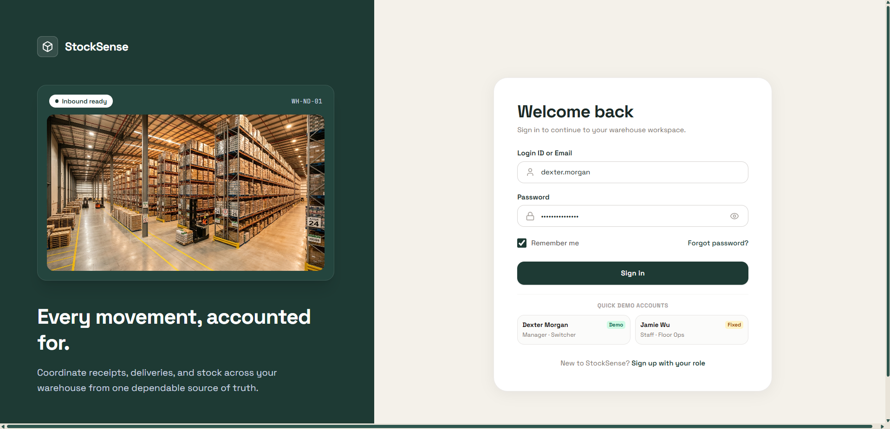
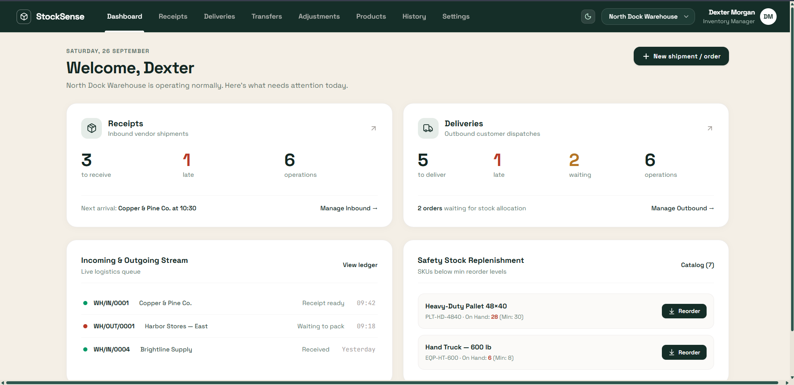
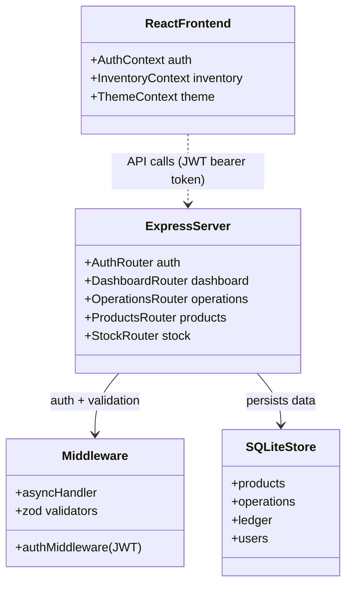
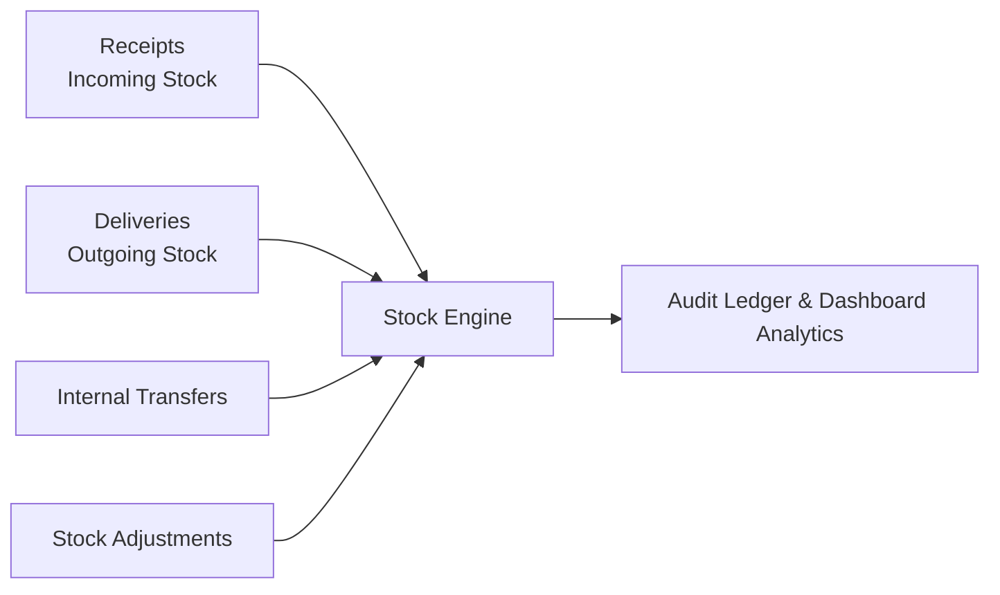

<div align="left">

# StockSense IMS

**Real-time inventory management system built with React, Vite, Tailwind CSS, and Node.js/Express**

[](https://typescriptlang.org)
[](https://react.dev)
[](https://expressjs.com)
[](https://bun.sh)
[](https://github.com/SiddarthReddyK/oodo-hackathon/blob/main/LICENSE)

</div>

---

## Demo

<p align="center">
  
  
</p>

_Login and dashboard views — real-time inventory KPIs and logistics activity_

---

## Overview

A modular Inventory Management System (IMS) built to digitize warehouse operations — receipts, deliveries, internal transfers, and stock adjustments — in place of manual spreadsheets. Originally built for the Odoo Hackathon, now continuing as an independent project.

**Domain:** Supply Chain & Inventory Management
**Stack:** React 19, Vite, Tailwind CSS v4, Express, SQLite
**Status:** Active Development

---

## System Architecture

A Vite-powered React client talks to an Express backend over a REST API; the backend persists all data to a file-based SQLite store.



---

## Operations Pipeline

Every inventory movement — regardless of type — flows into a single ledger for full auditability.



---

## Features

- **Real-Time Dashboard** — KPI cards for receipts/deliveries, live logistics stream, and low-stock alerts against reorder thresholds.
- **Operations Engine** — Receipts, deliveries, internal transfers, and stock adjustments, each with list + detail views and a status workflow (Draft → Ready/Waiting → Done).
- **Product Catalog** — SKU-level tracking with per-location stock, unit cost, and reorder minimums.
- **Audit-Grade Ledger** — Every stock movement is logged with reference, direction, and timestamp for full traceability.
- **Authentication** — JWT-based sessions with bcrypt-hashed passwords; role support for Inventory Manager / Warehouse Staff.
- **Dark Mode** — Full light/dark theming via CSS custom properties, persisted per-user.

---

## Tech Stack

| Layer                     | Technology                                                        |
| ------------------------- | ----------------------------------------------------------------- |
| Runtime & Package Manager | [Bun](https://bun.sh)                                             |
| Frontend                  | React 19, TypeScript, Vite, Tailwind CSS v4, Lucide Icons, Motion |
| Backend                   | Express (Node.js / Bun)                                           |
| Database                  | SQLite (via `sql.js`, persisted to disk)                          |
| Auth                      | JWT + bcrypt                                                      |
| Validation                | Zod                                                               |
| Deployment                | Docker, docker-compose                                            |

---

## Getting Started

### Prerequisites

- [Bun](https://bun.sh) v1.0+

### Local Development

```bash
# 1. Clone and install dependencies
git clone https://github.com/SiddarthReddyK/oodo-hackathon.git
cd oodo-hackathon
bun install

# 2. Configure environment
cp .env.example .env

# 3. Start the dev server
bun run dev
```

Open [http://localhost:3000](http://localhost:3000) in your browser.

### Production Build

```bash
bun run build
bun run start
```

### Running with Docker

```bash
docker compose up --build
```

The SQLite database persists in a named volume (`stocksense-data`) mounted to `/app/server/db`, so data survives container restarts and isn't tracked by git.

---

## Project Structure

```text
├── server/
│   ├── db/               # SQLite data store & auto-seeding logic (*.sqlite untracked)
│   ├── middleware/        # JWT authentication & async error handling
│   ├── routes/            # Auth, Dashboard, Operations, Products, Stock APIs
│   ├── validators/        # Zod schemas for request validation
│   └── server.ts          # Server entry point (Express + Vite)
├── src/
│   ├── components/        # Views — dashboard, auth, operations, products, ledger, settings
│   ├── context/           # Auth, Inventory, and Theme state
│   ├── data/               # Seed catalog & demo accounts
│   ├── services/           # API client + per-domain service wrappers
│   └── types/               # TypeScript domain interfaces
├── Dockerfile              # Bun-based container build
├── docker-compose.yml      # Container orchestration with volume persistence
└── package.json            # Scripts & dependencies
```

---

## License

MIT — see [LICENSE](./LICENSE).
